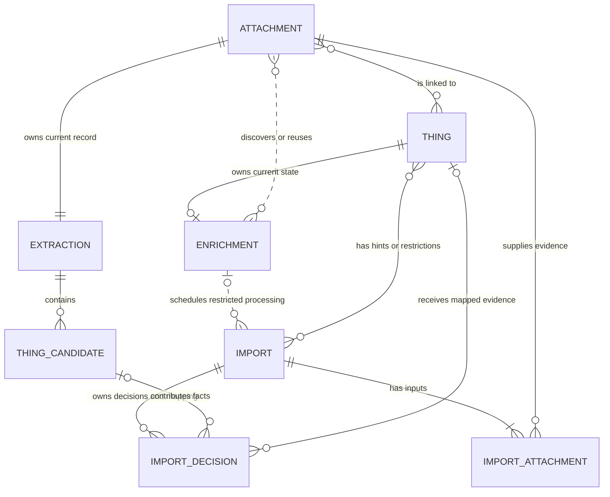
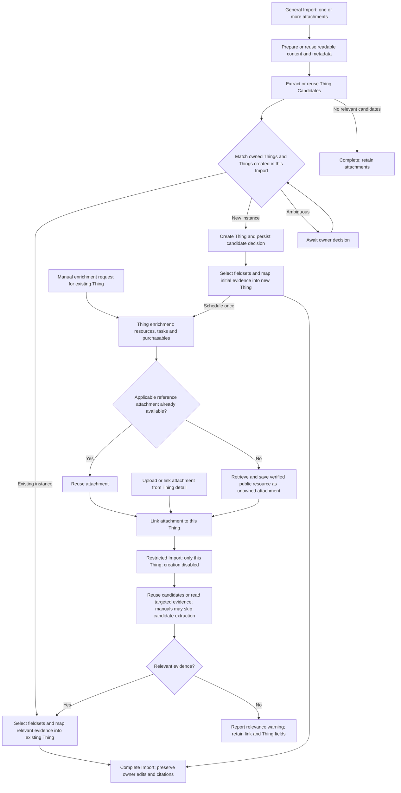

# Import improvements

Status: stages 1, 2, 4, 5 and 6 implemented. Stages 3, 7 and 8 are planned.

## Implemented stages

| Stage | Behaviour                                                                                   | Documentation                                                                                                                                      |
| ----- | ------------------------------------------------------------------------------------------- | -------------------------------------------------------------------------------------------------------------------------------------------------- |
| 1     | Named AI operations, application-owned batching, SDK transport and authored prompts/schemas | [Import lifecycle](../setup/imports.md#sequence), [backend conventions](../../server/AGENTS.md#ai-imports-and-assistant-work)                      |
| 2     | Registry mappings, useful custom fields and discard decisions with atomic checkpoints       | [Mapping](../setup/imports.md#sequence), [fact evaluation](../requirements/research/import-evaluations.md#fact-selection-evaluation)               |
| 4     | Public research eligibility from `instanceSpecific` metadata                                | [Research](../setup/imports.md#sequence)                                                                                                           |
| 5     | Category documents and progressive cited field enrichment                                   | [Research](../setup/imports.md#sequence), [model evaluation](../requirements/research/import-evaluations.md#reference-extraction-model-evaluation) |
| 6     | Validated official product photographs with owner-choice preservation                       | [Images](../setup/imports.md#sequence)                                                                                                             |

The following stages describe planned work. Preserve sources, ownership, sensitivity, provenance, per-set values, owner edits and retry checkpoints throughout.

## 3. Attachment extraction and Thing processing

Separate attachment interpretation, Import decisions and Thing enrichment. Retain the existing persisted runner shared with assistant chat. Deliver these boundaries incrementally within the application.

### Ownership and terminology

| Concept         | Owned data and responsibility                                                                                                                                             |
| --------------- | ------------------------------------------------------------------------------------------------------------------------------------------------------------------------- |
| Attachment      | Original content, metadata, reusable transcription and one current, replaceable extraction record.                                                                        |
| Extraction      | Optional Thing Candidate extraction, its status, completion date and source coverage. Distinguish skipped, completed with zero candidates, partial and failed extraction. |
| Thing Candidate | A name, category, terms and source-supported facts describing a possible Thing. Assign a server-generated UUID; retain attachment/page/quote provenance.                  |
| Import          | An owner-scoped process with links to one or more attachments, optional existing Thing context, matching/creation decisions, fieldset selection and mapping checkpoints.  |
| Thing           | The owned record receiving evidence from one or more candidates or from targeted attachment reading.                                                                      |
| Enrichment      | Thing-owned discovery of resources, suggested tasks and purchasables, with minimal persisted status and retry state.                                                      |

Plan application terminology as `ThingCandidate` and `thingCandidates`. Existing code uses `ExtractedThing`/`extractedThings` and provider/persistence data uses `candidates`; migrate these consistently during implementation. Fact IDs may remain local to a candidate when references include its UUID.

Attachment-to-Thing links record association. Import decisions identify which Thing Candidates contributed to which Things and whether mapping completed. Store these decisions and checkpoints within Import persistence; expose authorised candidate match annotations from those relationships. One candidate can support several Things, including Things belonging to different owners when the attachment is an unowned public reference. Matching decisions always remain owner-scoped. Several candidates from different attachments can contribute to one Thing.

Commit newly created Thing IDs with matching decisions so retries reuse them. Schedule enrichment when creation is committed. Persist the decision and resulting Thing association needed for recovery; a permanent matched-versus-created flag is optional if a delivered feature requires it.

### Entity relationships

These are planned domain relationships. Import attachment and Import decision represent links and checkpoints within Import persistence. Enrichment represents current Thing-owned state; it requires no run-history entity. A decision can await a Thing match or map targeted evidence with no Thing Candidate. Existing Thing inputs can be matching hints or scope restrictions.

Each Import attachment link records the consumed extraction date. Candidate-to-Thing decisions remain owner-scoped, including when several owners reuse one unowned reference attachment.

### Process flow

The general-review branch runs for each candidate, combining evidence across attachments. Ambiguous decisions wait independently while resolved Things continue. Existing-Thing processing uses relevant candidates when available or reads targeted evidence directly. Unsupported sources retain their attachment links without scheduling AI work.

Enrichment can attach several resources or find none. Task and purchasable suggestions are saved against the Thing. Document processing returns through the restricted Import branch and completes after mapping; automatic enrichment is triggered by Thing creation after initial mapping.

### Use cases

| Source and context                                                 | Planned outcome                                                                                                        |
| ------------------------------------------------------------------ | ---------------------------------------------------------------------------------------------------------------------- |
| 1.1.1 Unlinked source; one unknown Thing                           | Create one Thing, link the source, map and schedule enrichment.                                                        |
| 1.1.2 Unlinked source; one known Thing                             | Match the owned instance, link the source and populate that Thing.                                                     |
| 1.2.1 Unlinked source; several unknown Things                      | Create each relevant independent Thing and link the source to each.                                                    |
| 1.2.2 Unlinked source; several known Things                        | Resolve each owned instance and populate each Thing.                                                                   |
| 1.2.3 Unlinked source; known and unknown Things                    | Reuse identified instances and create the remaining Things.                                                            |
| 1.3 Unlinked source; no Thing information                          | Complete with a no-relevant-Things outcome; retain the attachment.                                                     |
| 2.1 Added from Thing detail; relevant evidence                     | Restrict matching to that Thing, read or reuse evidence, add applicable fieldsets and map facts. Creation is disabled. |
| 2.2 Added from Thing detail; relevant evidence plus other Things   | Process the specified Thing. Other available candidates can be reviewed through a separate general Import.             |
| 2.3 Added from Thing detail; unrelated evidence                    | Keep the requested link, report a relevance warning and leave Thing fields unchanged.                                  |
| Supporting document with insufficient identity, such as a warranty | Use the specified Thing as context for targeted reading and mapping; an attachment can have zero Thing Candidates.     |
| One Import with several attachments describing the same Thing      | Combine relevant evidence and create or match one Thing, retaining each source reference.                              |

A family manual describes product applicability; its model list alone is insufficient evidence of separately owned Things. Bulk receipts distinguish independent items and quantities and filter incidental purchases. Two units of the same model can be separate instances.

### Transcription and optional fact extraction

Separate readable-content preparation from Thing Candidate extraction. Plain text and embedded PDF text can be read without AI. Images and scanned PDFs may require vision or OCR; preserve original content and page references for diagrams and visual evidence. Cache reusable transcription on the attachment where useful. Assistant queries can use readable content directly.

General Imports extract Thing Candidates for identification, matching and creation. Reuse the attachment's current candidate extraction when available. Reference manuals can retain transcription and metadata with candidate extraction skipped. Existing-Thing Imports reuse relevant candidates or read the source with Thing context to extract only useful facts. Both evidence paths use shared fieldset selection, mapping, validation and owner-edit preservation.

Targeted reading can establish applicability and fill specified missing fields without enumerating every manual fact. Keep its Thing-specific evidence and mapping checkpoints within the Import. The user's selected Thing supplies intended context; document evidence still determines relevance and fact values. Keep reusable attachment extraction independent of the first Thing to which it is linked.

Each attachment retains one current extraction payload. Record `extractedAt` on the attachment and the value consumed on each Import-to-attachment relationship. Keep Import execution dates for progress/history. Candidate IDs change when extraction is replaced. Before continuing or committing candidate-based work, verify that the consumed extraction remains current; replacement invalidates unfinished decisions/checkpoints tied to the old candidates. Preserve allocated Thing IDs to prevent duplicate creation, and reassess their evidence before resuming mapping. Preserve already committed values and their attachment/page/quote provenance. Historical extraction payload retention is optional; replacing extraction loses reproducibility of the previous payload.

Distinguish extraction freshness from application completion. Completed link processing is reused across repeated PUTs and unlink/relink. Replacement extraction can supply new work after reassessment while preserving owner edits. Targeted processing tracks the source it consumed and has its own checkpoints. Unsupported media or unavailable import configuration still permit linking.

### Import matching and mapping

1. Validate attachment access and existing Thing context; persist attachment links and Import scheduling atomically, then wake the runner after commit.
2. General review considers candidates from all Import attachments against owned Things and against Things already created within that Import. Resolve evidence of the same instance together before creating another Thing. Manufacturer/model equality establishes compatibility; an automatic owned-instance match requires instance evidence.
3. Imports started by adding an attachment from Thing detail can match only that Thing and cannot create Things. The same restriction applies to documents attached by enrichment. General Imports may receive existing Things as matching hints; persist matching scope and creation permission separately from hints.
4. Persist candidate-to-Thing decisions, attachment-to-Thing links and processing checkpoints atomically. Ambiguous matches await owner decisions while other resolved Things continue. Recheck scope, allocation, extraction freshness and Thing existence before writes.
5. Select additional applicable fieldsets using existing Thing context and incoming evidence, then map progressively. Preserve selected sets, per-set values, sensitivity, conflicting provenance, owner edits and explicit clears. Facts from several attachments can contribute to the same Thing.
6. Creating a Thing schedules enrichment once. Applying further evidence to an existing Thing leaves enrichment available for manual triggering.

Per-candidate outcomes distinguish completed, awaiting decision, dismissed, cancelled and failed work. Targeted processing also reports progress when there are zero candidates. Failure for one Thing preserves progress elsewhere. Pending decisions release processing locks and remain visible in attachment/Import review. A successful empty result is distinct from skipped extraction, insufficient coverage or processing failure.

The bulk view lists candidates, decisions, processing status and links to Things. Owners can open Things as data arrives and cancel unfinished processing. Cancellation stops subsequent commits; committed Things and values remain available. Deleting a Thing is a separate owner action. Other candidates from restricted Imports can be reviewed in a general Import without rerunning completed extraction.

### Thing enrichment

Enrichment discovers relevant resources, suggested tasks and purchasables using the Thing's public research context. Consult accessible reference attachments before external retrieval. Newly created Things trigger enrichment after their initial field mapping is ready; a manual trigger can refresh an existing Thing.

Persist current Thing-owned status, warnings and operation checkpoints sufficient to resume after restart and avoid duplicate paid work and suggestions. Reuse existing result entities and the runner. Add historical run records only when a feature requires them. Import completion reports successful matching/mapping; Thing progress separately reports enrichment and its optional warnings.

A discovered or reused document is linked to the Thing and processed through an Import restricted to that existing Thing. Reuse transcription and applicable evidence; use targeted missing-field extraction for large manuals and full candidate facts only where useful. Coordinate existing cited document enrichment with shared Import mapping checkpoints so evidence is applied once. This restricted Import cannot create Things, so it does not trigger another enrichment round.

### Proposed HTTP contract

Author changes in `openapi.json` during implementation and regenerate `shared/api.ts`.

| Operation                                                 | Purpose                                                                                                                                                                    |
| --------------------------------------------------------- | -------------------------------------------------------------------------------------------------------------------------------------------------------------------------- |
| `POST /api/imports`                                       | Proposed multi-attachment entry point accepting attachment IDs, optional existing Thing hints and explicit matching/creation scope; return 202 with `importId` and status. |
| `POST /api/attachments/{attachmentId}:import`             | Single-attachment convenience entry point for general review, using the same Import model.                                                                                 |
| `PUT /api/attachments/{id}/things/{thingId}`              | Retain the link route and response contract; automatically schedule supported processing restricted to that Thing with creation disabled.                                  |
| `GET /api/imports/{id}`                                   | Return persisted progress, candidate decisions, Thing IDs, targeted-processing results, warnings, errors and usage.                                                        |
| `GET /api/imports/{id}/stream`                            | Authenticated, revisioned progress across input attachments and Things, including progress before creation.                                                                |
| `GET /api/things/{thingId}/stream`                        | Retain progressive Thing updates; expose attachment processing and Thing-owned enrichment status.                                                                          |
| `POST /api/imports/{id}:retry`                            | Resume eligible failures using current evidence, saved Thing allocations and valid checkpoints.                                                                            |
| `POST /api/imports/{id}/candidates/{candidateId}:resolve` | Proposed owner decision to match, create or dismiss a candidate, validated against the Import scope.                                                                       |
| `POST /api/imports/{id}/candidates/{candidateId}:cancel`  | Proposed cancellation of unfinished candidate processing; preserve committed results.                                                                                      |
| `POST /api/things/{thingId}:enrich`                       | Proposed manual enrichment trigger; resume unfinished work where appropriate.                                                                                              |

Initially accept one attachment per request if needed while implementing Import-to-attachment relationships that support several. Validate every supplied attachment and Thing against the authenticated owner/access rules. Streams omit raw extraction and private source content. Repeated requests reuse existing eligible work. Reuse existing contract components where their revised meanings fit.

### Migration and delivery

Deliver in reviewable increments:

1. Introduce attachment-owned transcription and optional replaceable candidate extraction, UUIDs, Import-to-attachment relationships and minimal Thing-owned enrichment state. Move current checkpoints to their respective owners.
2. Add automatic restricted processing on links, including context-dependent documents and targeted manual reading. Preserve repeated-link/retry behaviour and the link response contract.
3. Add general attachment review, delayed Thing creation, Import streaming, matching across multiple attachments, bulk decisions and cancellation. Migrate upload and pasted-text entry points together.

Replace import-wide `AWAITING_SELECTION` and confirmation payloads with candidate decisions. Migrate stored extraction, candidate references, allocations and jobs together. Recover waiting jobs under the recorded matching scope; preserve results and owner edits. Remove obsolete placeholders only after proving they are untouched and unreferenced. Retire `POST /api/things:import` with its callers in the coordinated release.

Release processing locks on terminal outcomes and while waiting for decisions. Reconnect and restart restore persisted progress. Source removal, unlinking and Thing deletion retain reference checks and prevent queued work repopulating removed relationships.

Acceptance: all use cases have integration coverage; multi-attachment evidence creates one Thing per identified instance across retries; restricted Imports never create Things; warranty facts can add fieldsets without a candidate; manuals support targeted reading with candidate extraction skipped; replacing extraction invalidates unfinished checkpoints while preserving allocated Things and committed provenance; enrichment triggers once after creation and resumes independently.

Issue scope:

- [#54](https://github.com/things-industries/boring-things/issues/54): automatic restricted processing on attachment links and discovered documents.
- [#55](https://github.com/things-industries/boring-things/issues/55): remove the import-wide selection stall and migrate waiting jobs; align issue wording with general review and restricted Imports.
- [#56](https://github.com/things-industries/boring-things/issues/56): additional Thing Candidate review through general Imports.
- [#46](https://github.com/things-industries/boring-things/issues/46): bulk allocation, filtering, progress, navigation and cancellation.

## 7. Unowned reference attachments

Use attachments for verified public reference documents and images. Store discovered resources as attachments with nullable ownership and link the same attachment to Things belonging to different owners. User-uploaded sources retain their owner; shared eligibility requires verified public provenance and relevance.

Record source URL, content hash, document type, publisher, applicability evidence, language and version on the attachment. Search accessible unowned attachments before external retrieval. Verify applicability against the new Thing, including model variants, region, language and document revision. Deduplicate verified public content and preserve metadata and citations. Shared transcription and optional candidate extraction can be reused. Targeted evidence, matching decisions, mapping and owner edits remain scoped to each owner and Thing.

Example: a data-plate photo creates an oven Thing; discovery saves its public manual as an unowned attachment and links it. Another owner's receipt creates the same oven model; discovery finds and validates the saved manual, then links that attachment to the new Thing and enriches its missing fields.

Access and lifecycle:

- Keep blob access authenticated. Authorise owner uploads by ownership and unowned references through permitted discovery/library access or an owned Thing link.
- Filter attachment `thingIds` and all related Thing projections to the authenticated owner's Things, including detail, list, import and stream responses. Shared metadata contains public resource evidence only.
- Owner actions can unlink an unowned attachment from their own Things. Shared content and metadata updates are system-managed; owner-specific display preferences require owner-scoped storage.
- Deleting one Thing, link or account preserves references used elsewhere. Garbage collection checks all live links, jobs, citations and image references before removing an attachment or blob. Define retention for unlinked reusable public references.
- Migrate attachment ownership constraints, link ownership, access helpers, discovery persistence and blob lifetime checks together. Existing private attachments remain private; reuse across owners begins with resources verified for shared use.

Acceptance: the oven scenario reuses one attachment; both owners receive only their own associated Thing IDs; one owner's unlink/deletion preserves the other's access; private uploads remain isolated; shared references retain applicability evidence and authenticated access.

## 8. Latency, evaluations and provider experiments

Build a task baseline from existing usage logs and persisted task usage: extraction, identity matching, field-set selection, mapping, resource retrieval, reference extraction, task suggestions and purchasable discovery. Record model/provider, prompt/schema version, input size/pages, tokens, request count, retries, stage duration, total duration and measured or dated estimated task cost. Include tool and retrieval costs. Report median and tail latency, failure rates and reuse savings.

### Evaluation approach

- Maintain labelled, synthetic or redacted fixtures covering the use-case table, bulk quantities, duplicate instances, ambiguous matches, irrelevant attachments, family manuals, multilingual/long documents and conflicting owner values.
- Separate deterministic fixture checks from paid provider evaluations. Version datasets and expected outcomes; retain cited evidence and score errors by severity.
- Measure Thing Candidate recall and precision, instance-match false positives, field-set selection, field precision/recall, unwanted custom fields, provenance, document applicability, retrieval success and suggestion compatibility. Unsafe instance merges and private-data exposure are release blockers.
- Compare candidate configurations on the same fixtures and full task, including validation, retries and fallback. Set quality thresholds and latency/cost targets before selecting a configuration. Keep a held-out dataset for the adoption decision.
- Paid evaluations remain opt-in and require owner approval for each invocation under [metered AI validation](../agents/agent-behaviour.md#metered-ai-validation). Default CI uses mocks and fixtures.

### Per-task model and provider selection

Choose configurations by task results. Evaluate smaller/faster models for bounded extraction, field selection and mapping; evaluate identity and research tasks against their own evidence and quality needs. Configure task-specific models behind existing application/provider boundaries, with bounded fallback policies, checkpoint reuse and observable routing. Record fallback cost and latency in the comparison.

Experiment with Jev for bounded decisions over extracted evidence, Firecrawl for retrieval and other providers where baseline measurements identify an opportunity. These are evaluation candidates; adoption requires an approved provider/infrastructure decision. Assess schema compatibility, source citations, privacy, retention, regional availability and operational failure handling alongside quality, latency and cost. Keep raw private sources and instance-specific values within their authorised processing scope.

Measure whether a separate identification pass reduces time to the first Thing or duplicates extraction cost. Persist source coverage and truncation; opening-page scans of long documents cannot identify all Things described in the source. Partial coverage exposes unresolved source regions and permits continued extraction without presenting the Thing Candidate list as complete. Compare single-pass extraction, page-aware batches and cached extraction reuse.

[Research references](../requirements/research/sources.md#import-provider-evaluation--4-october-2026) contain starting sources for experiments. Verify current provider capabilities and pricing when running comparisons. Record reproducible configurations, scores, latency, cost and the adoption recommendation in [import evaluations](../requirements/research/import-evaluations.md).

## Validation

- Stage 3: use-case matrix, transcription and optional extraction, consumed extraction dates, checkpoint invalidation, multi-attachment matching, restricted creation, owner scope, idempotent linking, fieldset additions, provenance, partial failures, candidate decisions, bulk cancellation, enrichment triggers/recovery, migrations, reconnect and restart. Browser coverage includes progress before creation and navigation between Things.
- Stage 7: shared attachment access, filtered Thing associations, public applicability, private-source isolation, deletion/reference lifetimes and extraction reuse across owners.
- Stage 8: labelled offline checks and approved provider runs with quality, latency and full-task cost comparisons.
- Follow [repository validation](../../README.md#validation). Maintain [product requirements](../requirements/product/PRODUCT.md) and the [import guide](../setup/imports.md) as behaviour is delivered. These stages describe planned capabilities.
