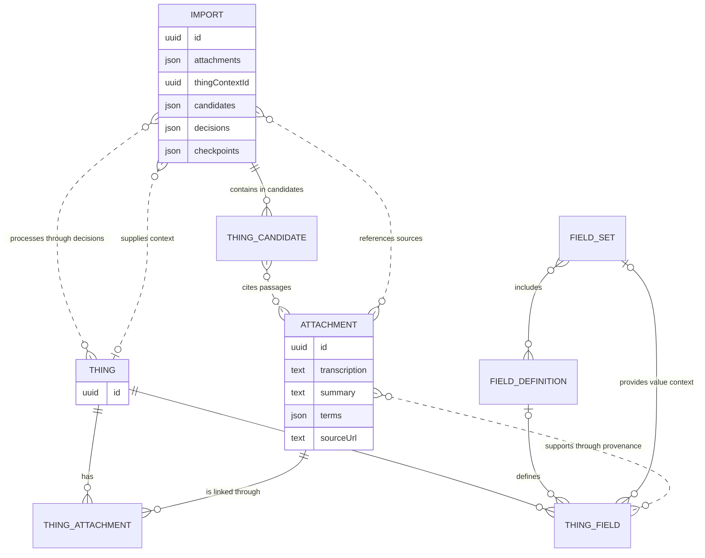
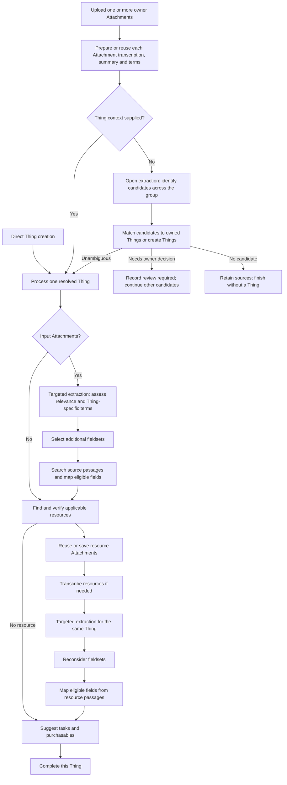

# Attachment transcription and Thing processing

Status: Attachment transcription and upload Import intent implemented; later stages planned.

This plan defines reusable Attachment transcription, owner-scoped Import processing and shared public reference Attachments. The [import guide](../setup/imports.md) describes current behaviour. The [backend conventions](../../server/AGENTS.md#ai-imports-and-assistant-work) describe implementation boundaries. Preserve source evidence, sensitivity, fieldset context, owner edits and retry checkpoints.

One persisted Import orchestrates Thing identification, fieldset selection, field mapping and Enrichment. Enrichment includes Discovery, resource processing and Recommendation. The Import records progress for each Thing and stage so one unresolved candidate does not stop other work.

## Ownership and terminology

| Concept          | Owned data and responsibility                                                                                                                                                                                      |
| ---------------- | ------------------------------------------------------------------------------------------------------------------------------------------------------------------------------------------------------------------ |
| Attachment       | Original file or text, metadata, reusable transcription, summary, optional source-wide terms and processing status. Owner uploads are private. A saved public resource is also an Attachment and has a source URL. |
| Transcription    | The Attachment's page-labelled readable content and image descriptions, with a completion status.                                                                                                                  |
| Import           | An owner-scoped workflow with bounded Attachment references, optional Thing context, open or targeted extraction, candidate decisions, per-Thing terms and stage checkpoints.                                      |
| Thing Candidate  | A possible Thing identified by an open Import. It has a name, category, candidate-specific terms and identifiers with Attachment and passage references. Its ID is generated by the server.                        |
| Thing            | The owner's record receiving fields, linked Attachments, suggested tasks and purchasables.                                                                                                                         |
| Thing Attachment | The persisted relationship linking a Thing to an Attachment.                                                                                                                                                       |
| Thing Field      | A value belonging to a Thing, with field definition and fieldset context where applicable, sensitivity and source provenance.                                                                                      |
| Field Definition | A registry definition reusable across fieldsets and as a standalone field. Custom Thing fields retain their own definition data.                                                                                   |
| Fieldset         | A registry group of field definitions selected for a Thing. Values retain their fieldset context.                                                                                                                  |
| Enrichment       | Import stages that run Discovery, resource processing and Recommendation for a Thing.                                                                                                                              |
| Discovery        | An Import operation that finds applicable public resources, reuses or saves them as Attachments, and adds them to the current Thing's processing.                                                                  |
| Recommendation   | Import operations that suggest management tasks and purchasables after applicable resources have been processed.                                                                                                   |

An Attachment owns source-wide transcription, summary and optional terms. An Import owns interpretations that depend on its group of sources or its Thing context. Open extraction stores Thing Candidates on the Import. Targeted extraction stores relevance, applicability and Thing-specific terms on the Import. Mapping writes justified values and citations to the Thing. Field values are extracted after Thing resolution and fieldset selection.

A saved public resource is an Attachment with a source URL and verified public provenance. An uploaded Attachment has no source URL. Shared access depends on verified public origin and an authorised Thing link, not on the URL alone. The same transcription, targeted extraction and mapping operations process uploads and resources.

An Attachment submission supplies one or more inputs and creates Import intent for their group or specified Thing. Direct Thing creation creates a zero-input Import with that Thing context. Zero inputs require Thing context. Every resolved Thing proceeds through fieldset selection and mapping when source material is available, then Enrichment. Discovery and Recommendation run automatically for new and existing Things.

Plan application terminology as `ThingCandidate` and `thingCandidates`. Current code uses `ExtractedThing` and `extractedThings`, while provider and persistence data use `candidates`; migrate these together with the workflow. Identifiers remain strings, including leading zeroes. Candidate IDs are server-generated UUIDs. Attachments, pages and quotes identify the evidence for candidate identity and Thing fields.

## Entity relationships

This diagram shows persisted entities and logical properties. Transcription, candidates, decisions and checkpoints are properties of their owning records. A Thing Candidate can cite several Attachments in one Import. A Thing Field retains source references after an Import completes.

The Import's Attachment list records each source ID. Access and deletion-reference checks use these properties. Created Thing IDs and committed field values survive retries. If transcription replacement is introduced, add revision tracking then so unfinished candidate, targeted extraction and mapping checkpoints can be invalidated while preserving committed Thing IDs, owner edits and Attachment/page/quote provenance.

## Process flow

Owner uploads create an open Import for their group or an Import restricted to one Thing. Discovery adds verified public resource Attachments to the same Import with the Thing already known. Each resolved Thing proceeds through its stages independently.

Resource processing is bounded and does not schedule another Discovery cycle. An applicable resource may add a fieldset before its fields are searched. Recommendation uses values committed after resource processing. Optional Discovery, resource and Recommendation failures add warnings and allow later stages to use available evidence. Work awaiting an owner decision about one candidate does not stop other Things.

## Use cases

| Source and context                                | Identification and Thing selection                                                                               | Thing-specific processing                                                                               | Follow-up                                                                       |
| ------------------------------------------------- | ---------------------------------------------------------------------------------------------------------------- | ------------------------------------------------------------------------------------------------------- | ------------------------------------------------------------------------------- |
| Unlinked source identifies one new Thing          | Open extraction creates one candidate; create a Thing when no owned instance matches.                            | Assess relevant passages, select fieldsets and map eligible fields.                                     | Discover resources, process them, then recommend tasks and purchasables.        |
| Unlinked source identifies an owned Thing         | Match the candidate using instance evidence.                                                                     | Assess evidence for that Thing and fill eligible gaps.                                                  | Discover resources, process them, then recommend tasks and purchasables.        |
| Grouped sources describe one Thing                | Combine transcriptions for open extraction; keep identifiers and terms on that candidate with source references. | Use relevant passages from every source, including a supporting document with no identifier of its own. | Each resolved Thing continues through Discovery and Recommendation.             |
| Sources describe several Things                   | Create candidate-specific identifiers, terms and source references; resolve each candidate independently.        | Assess and map passages for each resolved Thing without mixing their evidence.                          | Each resolved Thing proceeds through Enrichment after its own mapping finishes. |
| Source has no identifiable Thing                  | Record an empty open-extraction result; retain its transcription and summary.                                    | A later Thing-context Import can use the source.                                                        | No Thing is created from unidentified material.                                 |
| Owner adds a relevant source from Thing detail    | Use the specified Thing as the sole target.                                                                      | Check relevance, select additional fieldsets and map eligible fields.                                   | Discover resources, process them, then recommend tasks and purchasables.        |
| Owner adds a source concerning other Things       | Keep the link to the specified Thing and report relevance; retain the source for a later open Import.            | Apply only evidence relevant to the specified Thing.                                                    | Enrich the specified Thing; create no additional Thing.                         |
| Warranty document has little identity information | Use the specified Thing or a Thing resolved from other sources in the group.                                     | Add an applicable warranty fieldset and fill eligible fields with citations.                            | Discover resources, process them, then recommend tasks and purchasables.        |
| Direct Thing creation                             | Use the new Thing in a zero-input Import.                                                                        | Preserve initial fieldsets and values.                                                                  | Discover resources, process them, then recommend tasks and purchasables.        |
| Discovered or reused public manual                | Use the current Thing; verify model, variant, region and document edition.                                       | Reconsider fieldsets and map eligible public fields from cited passages.                                | Continue Recommendation in the same Import.                                     |

A family manual establishes applicability to product models; its model list alone does not establish ownership of separate Things. Bulk receipts distinguish items and quantities. Two owned units of the same model can be separate instances.

## Attachment transcription

Turn each allowed source format into page-labelled text. Read plain text and embedded PDF text locally. Use vision or OCR for images and scanned pages as needed. Describe relevant visual content in English and transcribe visible text while preserving approximate layout, reading order, table relationships and references to the original page or image region. Keep the original file for later visual checks and reprocessing.

The saved transcription contains English passages and omits repeated translations. An Attachment with no usable English content has an insufficient-language outcome; the original remains available. Source summaries and optional terms describe the Attachment as a whole. They may mention several Things, so candidate and Thing-specific terms belong to the Import.

Store transcription, summary, terms, completion date and status on the Attachment. Distinguish completed, empty, partly readable, insufficient-English and failed processing. Preserve source metadata edits and requests that clear metadata values. Assistant questions may read the transcription directly. Model choice for vision and summaries depends on measured accuracy, latency and cost.

## Import extraction and Thing selection

Open extraction examines the transcriptions, summaries and source-wide terms of an Import's bounded Attachment group. It returns possible Things with category, name, candidate-specific terms and identifiers such as manufacturer, model, serial, account or policy number. Each identifier states its kind, string value and source passage. Extract only identity evidence at this stage. Product lists in manuals establish document applicability; they do not establish ownership of separate Things. A large source can be searched by page or section so the same full document does not enter every later model request.

With no Thing context, match candidates against the owner's Things and Things already created in this Import. Match an owned instance only when identity evidence justifies that match; manufacturer and model alone establish product compatibility. Commit each creation and candidate decision with its Thing ID so retries reuse the same record. A candidate with no existing match can create a Thing. A candidate with ambiguous matching enters a per-candidate review-required state. The first delivery stores that state and candidate summary as a stub: it provides no owner resolution action yet. Other candidates continue. A later delivery adds candidate resolution and bulk review.

Targeted extraction runs when a Thing context is supplied and after each open candidate resolves to a Thing. It assesses which passages concern that Thing, checks available identifiers and document scope, and produces a Thing-specific summary and terms. A manual can apply through a verified model family even when it lacks the instance serial number. Conflicting model, variant, region or edition evidence blocks field updates from that source. A restricted Import never creates another Thing. If the linked upload is unrelated, retain the link and report the relevance outcome.

Store targeted assessments on the Import. When a group contains several Things, associate each source passage only with Things justified by its content and context. Retain unassigned passages in the Attachment transcription for later review. Successful empty, partly readable, insufficient-English and failed outcomes remain distinct.

## Fieldset selection and mapping

For each resolved Thing, use its category, existing fields, candidate or targeted terms, relevant Attachment summaries and source passages to find applicable registry fieldsets. Add eligible fieldsets that the owner has not removed. Check again after processing a newly discovered resource; its content may establish another applicable fieldset.

Search relevant source passages for the Thing's eligible empty fields in bounded batches. Inspect the field definition, value type, units and fieldset context before proposing a value. Validate the Attachment/page/quote reference, schema, sensitivity, Thing scope and any model or document variant before committing. Preserve owner edits and requests that clear a value. Check the current Thing under a lock when committing because its fields or selected sets may have changed during processing. Report material conflicts with existing values for review.

Use the selected fieldsets first, then eligible standalone registry definitions, then a bounded search for useful information outside the registry. Useful findings may become custom Thing fields with source citations or inform later registry work. Incidental content stays in the transcription. Public resources fill only eligible non-instance-specific fields; owner uploads may justify instance-specific fields. Do not send private identifiers or raw owner sources to public research.

Track field targets as unsearched, found, searched without enough evidence, skipped or failed. Save per-Thing, per-source and per-field-batch checkpoints, including the current field definitions. A retry rechecks owner changes and resumes unfinished work without repeating completed paid requests.

## Discovery and Recommendation

Discovery uses populated public, non-instance-specific Thing fields to find relevant documents and images for the category and product or service. Search stored public resources before external retrieval. Verify provenance and applicability, including model family, variant, region, language and document edition. Save or reuse applicable resources as unowned Attachments, link them to the Thing and record the link and resource checkpoint together.

Transcribe each applicable document or reuse its transcription. Run targeted extraction, fieldset selection and mapping for the same Thing inside the current Import. Search its content for eligible gaps using bounded page or section retrieval. Record resource and field-batch checkpoints. Images can become a main photograph when the owner has left that choice unset; they need no field mapping unless their content carries relevant evidence.

Recommendation starts after the bounded resource work reaches a terminal outcome. Use current Thing values, applicable resource content and URLs, bounded web search and separately approved specialised APIs where useful. Suggest cited maintenance or administration tasks and purchasables with observed purchase links and compatibility evidence. Preserve existing suggestions, dismissals and owner edits. Optional failures keep completed fields and other recommendations.

Direct Thing creation schedules a zero-input Thing-context Import. Every Import with a resolved Thing runs Enrichment after mapping, including Imports that update an existing Thing. One Import owns usage, warnings and per-Thing/per-resource checkpoints. The existing runner executes these operations; no child Import or separate scheduler is required.

## Shared public reference Attachments

Store verified public documents and images as Attachments with nullable ownership and a source URL. Link one shared Attachment to Things belonging to different owners. Record content hash, document type, publisher, language and edition on the Attachment. Store applicability to each Thing with the owner-scoped link or Import checkpoint. Deduplicate verified public content and reuse its transcription; Thing-specific assessments, field values, choices and edits remain owner-scoped.

- Authorise private uploads by ownership. Authorise shared resources through permitted Discovery/reuse access or an owned Thing link.
- Filter Attachment Thing associations in detail, list, Import and stream responses to the authenticated owner's Things. Shared metadata contains public evidence only.
- Owner actions can unlink a public resource from their Things. Shared content and metadata updates are system-managed; owner-specific display preferences require owner-scoped storage.
- Deleting a Thing, link or account preserves a shared Attachment while another reference uses it. Garbage collection checks live links, Imports, citations and image references.
- Migrate Attachment ownership constraints, link ownership, access helpers, discovery persistence and blob lifetime checks together. Existing private Attachments remain private.

Acceptance: a data-plate photo creates an oven Thing; Discovery finds and verifies its manual, saves it as a shared Attachment and fills eligible gaps. A second owner's Thing can reuse that manual. Each owner sees only their own linked Thing IDs, and one owner's unlink does not remove the other's access.

## Proposed HTTP contract

Author changes in `openapi.json` during implementation and regenerate `shared/api.ts`.

| Operation                                     | Purpose                                                                                                                                      |
| --------------------------------------------- | -------------------------------------------------------------------------------------------------------------------------------------------- |
| `POST /api/imports`                           | Submit bounded Attachment inputs and optional single Thing context. Zero inputs require Thing context; return 202 with Import ID and status. |
| `POST /api/attachments/{attachmentId}:import` | Reprocess one Attachment through an open or Thing-context Import.                                                                            |
| `PUT /api/attachments/{id}/things/{thingId}`  | Retain the link response contract; schedule processing restricted to that Thing.                                                             |
| `GET /api/imports/{id}`                       | Return status, candidate summaries and review-required stubs, Thing IDs, targeted outcomes, warnings, errors and usage.                      |
| `GET /api/imports/{id}/stream`                | Authenticated, revisioned progress before and after Thing creation.                                                                          |
| `GET /api/things/{thingId}/stream`            | Project the associated Import stages onto progressive Thing updates.                                                                         |
| `POST /api/imports/{id}:retry`                | Resume eligible work using saved Thing allocations and checkpoints.                                                                          |

Attachment upload accepts grouped open intent or one Thing context and creates queued Import intent as part of the submission. Validate every Attachment and Thing against owner and resource access rules. Streams omit private transcription and raw source content. Repeated requests reuse eligible completed work.

Candidate match/create/dismiss endpoints, bulk decisions and cancellation are deferred. The first delivery returns a review-required candidate stub with its possible matches and no resolution action. Preserve the source and the status until owner resolution is implemented. Existing `POST /api/imports/{id}:confirm` remains available for legacy waiting jobs until those jobs have a recovery path.

## Migration and delivery

Deliver in reviewable increments:

1. Implemented: Attachment-owned transcription, summary, optional terms and status. Readable content from stored Import extraction is copied where available; original files and committed field citations remain. Every owner upload creates queued Import intent. The current extraction request still identifies candidates and facts together, and existing Imports retain their stored text for retry compatibility.
2. Add Import-owned open candidates, per-candidate terms and identifiers, Thing-context targeted extraction, fieldset selection and bounded field mapping. Support grouped sources and per-Thing checkpoints. Persist review-required candidates as stubs; defer owner resolution actions. Keep the link route response contract and schedule restricted processing on links.
3. Add shared public resource Attachments, Discovery, resource processing and Recommendation within the same Import. Support zero-input Thing-context workflows for direct creation. Add candidate resolution, bulk review and cancellation in a later delivery.

Migrate stored extraction, candidate references, allocations and jobs together. Recover legacy waiting jobs through the existing confirmation route until replacement owner decisions are available. Preserve created Thing IDs, committed values, source citations and owner edits. Retire `POST /api/things:import` with its callers in a coordinated release.

Release processing locks on terminal outcomes and while waiting for owner decisions. Reconnect and restart restore persisted progress. Source removal, unlinking and Thing deletion retain reference checks and prevent queued work from restoring removed relationships.

Acceptance: grouped Attachments identify one instance across sources; candidate terms and identifiers stay with their candidate; restricted Imports create no Things; ambiguous candidates remain review-required while other Things progress; a warranty can add a fieldset without identifying a new Thing; a public manual can add a fieldset and fill eligible gaps; replacing transcription invalidates unfinished work while preserving committed fields; resource processing finishes before Recommendation; optional failures retain warnings without repeating completed paid work.

Issue scope:

- [#54](https://github.com/things-industries/boring-things/issues/54): automatic restricted processing on Attachment links and discovered documents.
- [#55](https://github.com/things-industries/boring-things/issues/55): migrate import-wide selection waiting and preserve legacy waiting-job recovery.
- [#56](https://github.com/things-industries/boring-things/issues/56): later candidate review and resolution.
- [#46](https://github.com/things-industries/boring-things/issues/46): later bulk allocation, progress, navigation and cancellation.

## Validation

- Cover transcription status, image and table layout, grouped identity, candidate-specific terms, identifiers with leading zeroes, matching, review-required stubs, restricted processing and fieldset additions. Add source-version checks when transcription replacement is supported.
- Verify passage retrieval, value citations, conflict handling, owner edits, requests that clear values, standalone/custom fields, sensitivity, partial failures and idempotent retries. Use a multi-Thing source to check that evidence stays with its Thing.
- Verify workflow stage ordering, zero-input context, resource processing in the same Import, restart recovery and progress streams. Browser coverage includes progress before creation and navigation between Things.
- Verify shared Attachment access, filtered Thing associations, public applicability, private-source isolation, deletion lifetimes and evidence reuse across owners. Include the oven-manual example.
- Follow [repository validation](../../README.md#validation). Maintain [product requirements](../requirements/product/PRODUCT.md) and the [import guide](../setup/imports.md) as behaviour is delivered.

Quality, latency, cost and provider measurements are recorded in [import evaluations](../requirements/research/import-evaluations.md).
