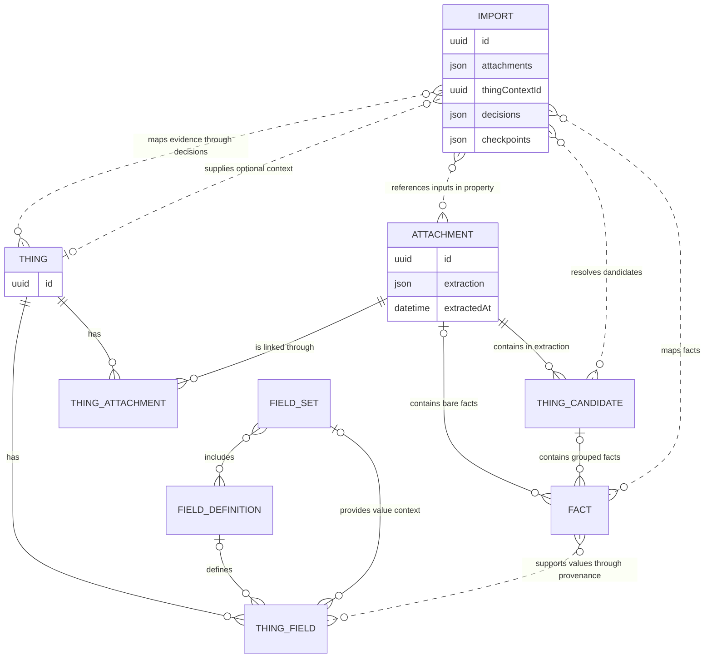
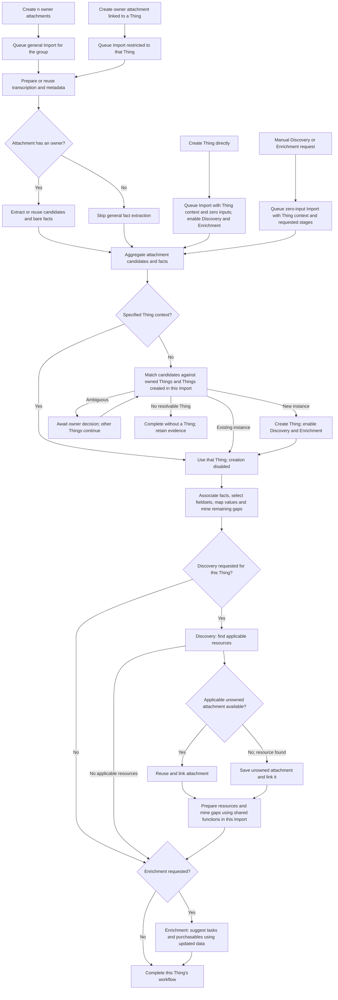

# Attachment extraction and Thing processing

Status: planned.

This plan defines reusable attachment interpretation, owner-scoped Import orchestration and shared public reference attachments. Preserve sources, sensitivity, provenance, per-set values, owner edits and retry checkpoints throughout. The [import guide](../setup/imports.md) documents current behaviour; [backend conventions](../../server/AGENTS.md#ai-imports-and-assistant-work) describe implementation boundaries.

Keep attachment interpretation reusable and let one persisted Import orchestrate matching/mapping, Discovery, resource processing and Enrichment. These are shared application operations executed by the existing runner. Checkpoint each Thing and stage independently so bulk work progresses without waiting for unrelated decisions.

## Ownership and terminology

| Concept          | Owned data and responsibility                                                                                                                                                                   |
| ---------------- | ----------------------------------------------------------------------------------------------------------------------------------------------------------------------------------------------- |
| Attachment       | Original content, metadata, reusable transcription and one current, replaceable extraction property containing Thing Candidates and bare facts.                                                 |
| Extraction       | A process whose status, completion date, coverage and output belong to the attachment. Distinguish skipped, completed with no evidence, partial and failed extraction.                          |
| Thing Candidate  | A name, category, terms and source-supported facts describing a possible Thing. Stored within attachment extraction; assign a server-generated UUID.                                            |
| Fact             | A source-supported label/value with sensitivity and attachment/page/quote provenance. Belongs to a Thing Candidate or directly to the attachment as a bare fact.                                |
| Import           | An owner-scoped workflow with bounded input references, optional single Thing context, matching decisions and per-Thing checkpoints for mapping, Discovery, resource processing and Enrichment. |
| Thing            | The owned record receiving evidence, linked attachments, suggested tasks and purchasables. Workflow progress is projected from its Imports.                                                     |
| Thing Attachment | The persisted relationship linking a Thing to an attachment.                                                                                                                                    |
| Thing Field      | A value belonging to a Thing, with field definition and fieldset context where applicable, sensitivity and source provenance.                                                                   |
| Field Definition | A registry definition reusable across fieldsets and as a standalone field. Custom Thing fields retain their own definition data.                                                                |
| Fieldset         | A registry group of field definitions selected for a Thing. Values retain their fieldset context.                                                                                               |
| Discovery        | An application operation that finds resources, reuses accessible reference attachments and saves discovered attachments for processing in the same Import.                                      |
| Enrichment       | An application operation that suggests tasks and purchasables after Discovery and resource processing finish for that Thing.                                                                    |

Attachment extraction output/status belong to the attachment. The Import owns orchestration, matching decisions, attachment references and stage checkpoints as properties. Discovery and Enrichment require no separate entities, scheduling records or child Imports. Thing results remain owned by the Thing. Keep persistence sufficient for restart/retry without introducing process-run history.

An attachment submission supplies one or more inputs. Direct Thing creation and manual Discovery/Enrichment create an Import with that Thing context and zero initial attachments. Zero inputs require a Thing context. Store the requested operations explicitly: attachment updates normally run mapping/mining; new Thing creation runs Discovery and Enrichment after mapping; manual requests can run Discovery plus Enrichment or Enrichment alone.

Plan application terminology as `ThingCandidate` and `thingCandidates`. Current code uses `ExtractedThing`/`extractedThings` and provider/persistence data uses `candidates`; migrate consistently during implementation. Give candidates and bare facts server-generated UUIDs; candidate facts may use local IDs qualified by candidate UUID. Preserve source attachment/page/quote references.

Thing Attachment records association. Import decisions record which evidence contributed to which Thing and whether mapping completed. Expose authorised candidate matches from those properties. One reference candidate can support several Things; matching decisions remain owner-scoped. Several candidates or bare-fact attachments can contribute to one Thing.

The Import's bounded attachment list records each attachment ID and consumed extraction date. Apply access, deletion-reference and freshness checks to these properties. Commit created Thing IDs with decisions so retries reuse them. Enable Discovery and Enrichment for newly created Things, after their initial mapping finishes. Persist these requested stages with creation so retries retain the workflow scope.

## Entity relationships

This diagram includes persisted entities and logical Thing Candidate/Fact components of attachment properties. Extraction and process state remain properties. Each Fact belongs to either an attachment directly or a Thing Candidate. Registry-backed Thing fields reference definitions; standalone fields have no fieldset and custom fields have no registry definition. Field definitions can appear in several fieldsets.

Fact provenance retained on Thing fields survives replacement of attachment extraction. The Fact relationship represents source evidence; historical Fact records need no foreign-key lifetime.

## Process flow

Owner uploads create Import intent for their group or specified Thing. Prepare readable content and extract candidates/facts for owned uploads, including uploads already linked to a Thing. Unowned public references use transcription and targeted mining. Each resolved Thing follows its requested stages independently within the same Import.

Discovery can find several resources; finish the bounded resource-processing stage before Enrichment. Resource attachments are recorded in this Import's checkpoints and use shared applicability, mapping/mining and provenance functions. They stay within the existing Thing context and cannot create Things or schedule another Discovery cycle. Optional Discovery/resource failures add warnings and allow Enrichment to use committed evidence. Work awaiting decisions about other Things does not block this Thing's stages.

## Use cases

The Research column describes the Discovery operation. Mapping preserves owner edits, explicit clears, sensitivity and source provenance; it fills eligible empty fields, retains useful custom facts and mines remaining gaps. Research processes discovered resources within the same Import before Enrichment runs.

| Source and context                                                 | Extraction                                                                           | Thing selection                                                                    | Fieldset selection                                                                       | Mapping                                                                                     | Research                                                                            | Enrichment                                                                                 |
| ------------------------------------------------------------------ | ------------------------------------------------------------------------------------ | ---------------------------------------------------------------------------------- | ---------------------------------------------------------------------------------------- | ------------------------------------------------------------------------------------------- | ----------------------------------------------------------------------------------- | ------------------------------------------------------------------------------------------ |
| 1.1.1 Unlinked source; one unknown Thing                           | Transcribe; extract one candidate and any bare facts.                                | Search owned Things; create one Thing when no instance matches.                    | Select applicable fieldsets from candidate and bare-fact evidence.                       | Apply facts to the new Thing; mine remaining gaps.                                          | Discover or reuse public resources; link them and mine eligible gaps.               | After resource processing, suggest tasks and purchasables from updated public data.        |
| 1.1.2 Unlinked source; one known Thing                             | Transcribe; extract one candidate and any bare facts.                                | Match the owned instance; retain ambiguous matches for owner decision.             | Consider additional fieldsets using existing Thing context and incoming facts.           | Add missing values and useful custom facts to the matched Thing; mine gaps.                 | Not scheduled automatically for an existing Thing.                                  | Not scheduled automatically; available by manual request.                                  |
| 1.2.1 Unlinked source; several unknown Things                      | Transcribe; extract distinct candidates and bare facts.                              | Resolve candidates together; create one Thing per identified instance.             | Select applicable fieldsets independently for each new Thing.                            | Associate facts with each Thing; map and mine each independently.                           | Run for each new Thing after its initial mapping; process resources in this Import. | Run independently for each Thing after its resources are processed.                        |
| 1.2.2 Unlinked source; several known Things                        | Transcribe; extract distinct candidates and bare facts.                              | Match each owned instance; ambiguous candidates await decisions independently.     | Consider additional fieldsets for each matched Thing using its context and facts.        | Map relevant evidence into each Thing; retain unresolved bare facts on the attachment.      | Not scheduled automatically for matched existing Things.                            | Not scheduled automatically; available by manual request.                                  |
| 1.2.3 Unlinked source; known and unknown Things                    | Transcribe; extract distinct candidates and bare facts.                              | Match owned instances and create remaining Things; reuse decisions across retries. | Select sets for new Things; consider additional sets for existing Things.                | Map and mine relevant evidence independently for each resolved Thing.                       | Run automatically for newly created Things only.                                    | Run for new Things after resource processing; existing Things require a manual request.    |
| 1.3 Unlinked source; no candidates or resolvable Thing             | Transcribe; retain any bare facts or a completed empty result.                       | No target can be resolved without candidates or Thing context; create no Thing.    | Skip because there is no target Thing.                                                   | Skip; retain attachment evidence for later contextual use.                                  | Skip because there is no target Thing.                                              | Skip because there is no target Thing.                                                     |
| 2.1 Added from Thing detail; relevant evidence                     | Transcribe; extract candidates and bare facts even though the upload is linked.      | Use the specified Thing as the sole target; creation is disabled.                  | Consider additional fieldsets from incoming facts and existing Thing context.            | Map relevant facts and mine remaining gaps in the specified Thing.                          | Not scheduled automatically by attachment addition.                                 | Not scheduled automatically; available by manual request.                                  |
| 2.2 Added from Thing detail; relevant evidence plus other Things   | Transcribe; retain all candidates and bare facts.                                    | Use only the specified Thing; retain other candidates for later general review.    | Consider additional fieldsets using evidence relevant to the specified Thing.            | Apply only relevant facts; other candidate evidence remains on the attachment.              | Not scheduled automatically by attachment addition.                                 | Not scheduled automatically; available by manual request.                                  |
| 2.3 Added from Thing detail; unrelated evidence                    | Transcribe; retain source-supported candidates and bare facts.                       | Keep the specified Thing context and link; report a relevance warning.             | Leave the Thing's selected fieldsets unchanged.                                          | Leave fields unchanged; retain evidence on the attachment.                                  | Not scheduled automatically by attachment addition.                                 | Not scheduled automatically; available by manual request.                                  |
| Supporting document with insufficient identity, such as a warranty | Transcribe; extract bare facts even when there are zero candidates.                  | Use the specified Thing context as the sole target.                                | Add applicable fieldsets, such as extended warranty, using bare facts and Thing context. | Populate relevant empty fields and useful custom facts; mine remaining gaps.                | Not scheduled automatically for the existing Thing.                                 | Not scheduled automatically; available by manual request.                                  |
| One Import with several attachments describing the same Thing      | Transcribe each input; extract or reuse its candidates and bare facts.               | Resolve one instance across the group; match or create one Thing.                  | Use combined evidence and existing context to select or add fieldsets.                   | Apply grouped bare facts using the resolved Thing context; preserve every source reference. | Run only if this Import creates the Thing or Research was explicitly requested.     | Run after resources for a new Thing, or when explicitly requested.                         |
| Create a Thing directly                                            | No input attachment extraction; queue a zero-input Import with Thing context.        | Use the newly created Thing; no further creation is needed.                        | Keep fieldsets selected during direct creation.                                          | Keep initial values; later discovered resources can fill eligible gaps.                     | Discover or reuse applicable resources using the initial public Thing data.         | Suggest tasks and purchasables after resource processing completes.                        |
| Unowned reference discovered or reused during Research             | Prepare or reuse transcription and metadata; skip general candidate/fact extraction. | Use the current Thing; process the resource within its existing Import.            | Use selected fieldsets to identify eligible empty-field targets.                         | Mine applicable gaps with page/quote evidence; images need no field mapping.                | Continue the current resource-processing stage without scheduling another search.   | Wait until bounded resource processing finishes, then use the updated data and references. |

A family manual describes product applicability; its model list alone is insufficient evidence of separately owned Things. Bulk receipts distinguish independent items and quantities and filter incidental purchases. Two units of the same model can be separate instances.

## Extraction and targeted mining

Separate readable-content preparation from AI extraction. Plain text and embedded PDF text can be read without AI. Images and scanned PDFs may require vision or OCR; retain original content and page references for visual evidence. Cache useful transcription on attachments; assistant queries can use readable content directly.

Owned user-uploaded supported attachments extract Thing Candidates and bare facts, including uploads from Thing detail. Bare facts are facts whose Thing cannot be identified from that attachment alone. Extraction remains independent of its first linked Thing. A completed extraction can contain zero candidates and several bare facts, or no useful evidence.

Unowned reference attachments skip general candidate/bare-fact extraction. Prepare readable content and metadata, then mine applicable empty-field targets using the existing bounded document extraction capability and shared validation/provenance rules. Discovery calls these functions within the same Import and saves per-resource/per-field checkpoints. Metadata and applicability can be established during mining without enumerating every manual fact. Existing owned uploads reused as references can supply their saved facts.

Ownership selects the default extraction strategy; processing limits and targeted reading also apply to large owner uploads. Preserve original content and source quotes while preferring English sections and excluding translated repetitions from working input. An unowned reference submitted to a general Import without resolvable candidates or Thing context reports insufficient identity. Automatic candidate-extraction fallback for that case is deferred.

Each attachment retains one replaceable extraction property and `extractedAt`. The Import attachment list records the date actually consumed. Before continuing or committing candidate/bare-fact work, check freshness; replacement invalidates unfinished decisions/checkpoints referencing old evidence IDs. Preserve allocated Thing IDs, committed values and attachment/page/quote provenance while reassessing evidence. Historical extraction payload retention is optional. Targeted mining records consumed content and completed field batches in Import checkpoints.

Repeated requests and unlink/relink reuse eligible completed processing. Unsupported media or unavailable AI configuration still create an associated Import outcome describing skipped processing and preserve the attachment/link. Every new upload belongs to a general or Thing-specific Import submission.

## Import resolution and mapping

1. Validate inputs, record the bounded attachment list and optional single Thing context, and schedule required extraction and the queued Import. Persist this intent with attachment creation; wake the runner after commit.
2. Wait for the group's required extraction to reach a usable or terminal outcome, then aggregate candidates and bare facts. Preserve extraction failures as per-attachment outcomes; process available evidence and expose retry eligibility.
3. A specified Thing context is the sole target and disables creation, including when every attachment has zero candidates. Assess evidence relevance to that Thing. Unrelated data leaves its fields unchanged.
4. With no context, match candidates against owned Things and Things being created within the same Import. Evidence describing the same instance contributes to one Thing. Manufacturer/model equality establishes compatibility; automatic owned-instance matching requires instance evidence.
5. When grouped attachments resolve to one Thing, use that Thing as context for bare facts from the other attachments. Grouping supplies the assumed relationship; evidence checks still prevent unrelated or conflicting facts being applied silently. With several resolved Things, associate bare facts using their content and candidate evidence. Retain unresolved bare facts on their attachments. With zero candidates and no context, complete without creating a Thing from unidentified scraps.
6. Store candidate/fact decisions, created Thing IDs and mapping checkpoints as Import properties; persist Thing Attachment links with related writes. Recheck ownership, scope, Thing existence and extraction freshness before applying evidence.
7. Select applicable fieldsets from existing Thing context plus incoming evidence, then map progressively. Retain per-set values, standalone/custom fields, sensitivity, conflicts, owner edits and explicit clears. Research-document mining fills eligible gaps through the same validation and provenance path.
8. Continue each newly created Thing through Discovery, resource processing and Enrichment after initial mapping. Existing-Thing attachment updates finish after mapping/mining unless additional stages were explicitly requested. Zero-input, Thing-context workflows skip attachment stages. Keep requested stages and completed work in the same Import checkpoints.

Per-candidate decisions and per-Thing mapping expose completed, awaiting decision, dismissed, cancelled and failed work. Bare-fact and targeted-mining progress are available with zero candidates. Owners can open Things as data arrives and cancel unfinished processing. Cancellation prevents later commits while preserving committed records and values. Other candidates from restricted Imports can be reviewed through a later general Import. Successful empty processing remains distinct from skipped extraction, insufficient coverage and failure.

## Discovery and Enrichment in the Import workflow

Discovery uses non-instance-specific public Thing fields to find relevant documents and images. Search accessible unowned reference attachments before external retrieval and validate applicability. Save verified public resources as unowned attachments, linking them through Thing Attachment. Preserve owner image choices, removed links and reference provenance.

Call shared attachment preparation, fact application and targeted gap-mining functions directly for these resources. Record attachment IDs, consumed evidence and completed batches in the existing Import. Process them only against the existing Thing; resource creation joins the current workflow. User-uploaded attachments still create or join an Import submission. Persist attachment creation/linking with the corresponding workflow checkpoint to recover interrupted work.

After Discovery and bounded resource processing reach terminal outcomes, Enrichment uses updated public fields and applicable reference content/URLs to suggest tasks and purchasables. Preserve citation, compatibility, deduplication, dismissal and owner-edit rules. Optional retrieval/model failures add warnings while allowing later stages to use available results. Database and core blob-persistence failures remain fatal to the operation that failed.

One Import owns the requested stages, usage, warnings and per-Thing/per-resource checkpoints. Resume unfinished stages after retry/restart; completed extraction, allocation, mapping, resources and suggestions are reused. Keep work bounded and yield between runnable Thing stages as needed; orchestration requires no dependency graph of child Imports. Serialise conflicting updates to the same Thing and recheck current values under locks before committing.

Direct Thing creation schedules a zero-input, Thing-context Import with Discovery and Enrichment enabled. Manual Discovery schedules that scope for an existing Thing; manual Enrichment requests suggestions only. Newly created Things in a general Import get the same stages in their current workflow. One Thing's partial failure or pending decision preserves other Things' progress. SSE projects Import stages onto Thing progress.

## Unowned reference attachments

Use attachments for verified public reference documents and images. Store discovered resources as attachments with nullable ownership and link the same attachment to Things belonging to different owners. User-uploaded sources retain their owner; shared eligibility requires verified public provenance and relevance.

Record source URL, content hash, document type, publisher, applicability evidence, language and version on the attachment. Search accessible unowned attachments before external retrieval. Verify applicability against the new Thing, including model variants, region, language and document revision. Deduplicate verified public content and preserve metadata and citations. Shared transcription and optional candidate/bare-fact extraction can be reused. Targeted evidence, matching decisions, mapping and owner edits remain scoped to each owner and Thing.

Example: a data-plate photo creates an oven Thing; discovery saves its public manual as an unowned attachment and links it. Another owner's receipt creates the same oven model; discovery finds and validates the saved manual, then links that attachment to the new Thing and enriches its missing fields.

Access and lifecycle:

- Keep blob access authenticated. Authorise owner uploads by ownership and unowned references through permitted Discovery/reuse access or an owned Thing link.
- Filter attachment `thingIds` and all related Thing projections to the authenticated owner's Things, including detail, list, import and stream responses. Shared metadata contains public resource evidence only.
- Owner actions can unlink an unowned attachment from their own Things. Shared content and metadata updates are system-managed; owner-specific display preferences require owner-scoped storage.
- Deleting one Thing, link or account preserves references used elsewhere. Garbage collection checks all live links, jobs, citations and image references before removing an attachment or blob. Define retention for unlinked reusable public references.
- Migrate attachment ownership constraints, link ownership, access helpers, discovery persistence and blob lifetime checks together. Existing private attachments remain private; reuse across owners begins with resources verified for shared use.

Acceptance: the oven scenario reuses one attachment; both owners receive only their own associated Thing IDs; one owner's unlink/deletion preserves the other's access; private uploads remain isolated; shared references retain applicability evidence and authenticated access.

## Proposed HTTP contract

Author changes in `openapi.json` during implementation and regenerate `shared/api.ts`.

| Operation                                                 | Purpose                                                                                                                                                                     |
| --------------------------------------------------------- | --------------------------------------------------------------------------------------------------------------------------------------------------------------------------- |
| `POST /api/imports`                                       | Import submission/review with bounded inputs, optional single Thing context and requested stages. Zero inputs require Thing context; return 202 with `importId` and status. |
| `POST /api/attachments/{attachmentId}:import`             | Single-attachment reprocessing/review entry point using the same Import model.                                                                                              |
| `PUT /api/attachments/{id}/things/{thingId}`              | Retain the link route and response contract; automatically schedule supported processing restricted to that Thing with creation disabled.                                   |
| `GET /api/imports/{id}`                                   | Return persisted progress, candidate decisions, Thing IDs, targeted-processing results, warnings, errors and usage.                                                         |
| `GET /api/imports/{id}/stream`                            | Authenticated, revisioned progress across input attachments and Things, including progress before creation.                                                                 |
| `GET /api/things/{thingId}/stream`                        | Retain progressive Thing updates; expose mapping/mining, Discovery and Enrichment stages from the associated Import workflow.                                               |
| `POST /api/imports/{id}:retry`                            | Resume eligible failures using current evidence, saved Thing allocations and valid checkpoints.                                                                             |
| `POST /api/imports/{id}/candidates/{candidateId}:resolve` | Proposed owner decision to match, create or dismiss a candidate, validated against the Import scope.                                                                        |
| `POST /api/imports/{id}/candidates/{candidateId}:cancel`  | Proposed cancellation of unfinished candidate processing; preserve committed results.                                                                                       |
| `POST /api/things/{thingId}:enrich`                       | Proposed manual suggestion refresh using available Thing data and references.                                                                                               |

Attachment upload accepts grouped general intent or one Thing context and creates the associated queued Import as part of the submission. Update `POST /api/attachments` and grouped-upload contract handling together; new attachments always carry Import intent. Add proposed `POST /api/things/{thingId}:research` for a Thing-context Import performing Discovery, resource processing and Enrichment. Initially accept one attachment per request if needed while storing a bounded reference list that supports several. Validate every supplied attachment and Thing against the authenticated owner/access rules. Streams omit raw extraction and private source content. Repeated requests reuse existing eligible work. Reuse existing contract components where their revised meanings fit.

## Migration and delivery

Deliver in reviewable increments:

1. Introduce attachment-owned transcription/extraction with candidates and bare facts, evidence IDs, bounded Import input properties and matching/mapping checkpoints. Include nullable attachment ownership, owner-scoped Thing Attachment links, authenticated reference access and filtered Thing associations in the persistence migration. Create queued Import intent with every upload.
2. Add automatic restricted processing on links, grouped bare-fact resolution and targeted document mining. Preserve repeated-link/retry behaviour and the link response contract.
3. Add Discovery, resource processing and Enrichment as operations with persisted checkpoints in the same Import; support zero-input Thing-context workflows for direct creation/manual requests. Deliver grouped matching, bulk decisions and cancellation with upload and pasted-text entry points together.

Replace import-wide `AWAITING_SELECTION` and confirmation payloads with candidate decisions. Migrate stored extraction, candidate references, allocations and jobs together. Recover waiting jobs under the recorded matching scope; preserve results and owner edits. Remove obsolete placeholders only after proving they are untouched and unreferenced. Retire `POST /api/things:import` with its callers in the coordinated release.

Release processing locks on terminal outcomes and while waiting for decisions. Reconnect and restart restore persisted progress. Source removal, unlinking and Thing deletion retain reference checks and prevent queued work repopulating removed relationships.

Acceptance: all use cases have integration coverage; multi-attachment evidence creates one Thing per identified instance across retries; restricted Imports never create Things; warranty facts can add fieldsets without a candidate; unowned manuals support targeted mining with general extraction skipped; replacing extraction invalidates unfinished checkpoints while preserving allocated Things and committed provenance; new Things progress through Discovery, resource mining and Enrichment within one Import; Enrichment sees committed resource data; optional failures retain warnings without repeating completed paid work.

Issue scope:

- [#54](https://github.com/things-industries/boring-things/issues/54): automatic restricted processing on attachment links and discovered documents.
- [#55](https://github.com/things-industries/boring-things/issues/55): remove the import-wide selection stall and migrate waiting jobs; align issue wording with general review and restricted Imports.
- [#56](https://github.com/things-industries/boring-things/issues/56): additional Thing Candidate review through general Imports.
- [#46](https://github.com/things-industries/boring-things/issues/46): bulk allocation, filtering, progress, navigation and cancellation.

## Validation

- Cover the use-case matrix, extraction/transcription, consumed extraction dates, checkpoint invalidation, multi-attachment matching, restricted creation, owner scope, idempotent linking, fieldset additions, provenance, partial failures, candidate decisions and bulk cancellation.
- Verify workflow stage ordering and recovery, zero-input Thing context, resource processing within the same Import, migrations, reconnect and restart. Browser coverage includes progress before creation and navigation between Things.
- Verify shared attachment access, filtered Thing associations, public applicability, private-source isolation, deletion/reference lifetimes and evidence reuse across owners. Include the oven-manual reuse scenario.
- Follow [repository validation](../../README.md#validation). Maintain [product requirements](../requirements/product/PRODUCT.md) and the [import guide](../setup/imports.md) as behaviour is delivered.

Quality, latency, cost and provider experiments are defined in the [import latency and provider evaluation plan](import-provider-evaluations.md).
